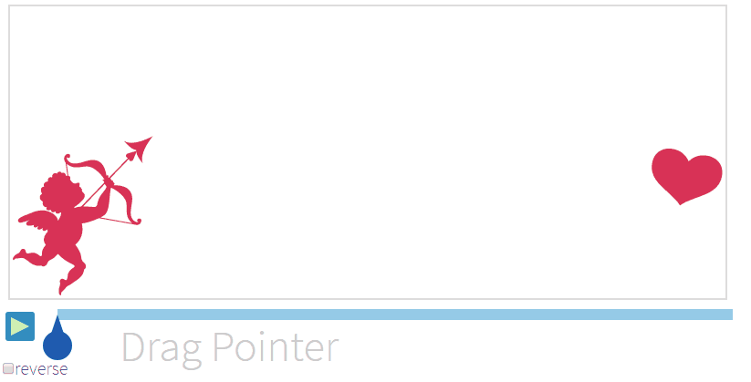
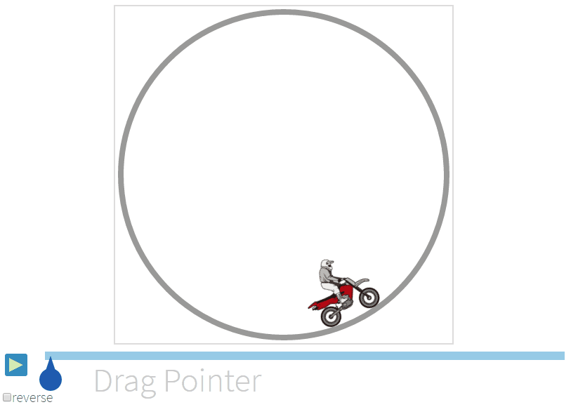

# AnimSequence

Simple Animation Controller with Timeline

**<a href="https://anseki.github.io/anim-sequence/">Document and Examples https://anseki.github.io/anim-sequence/</a>**

[](https://anseki.github.io/anim-sequence/)
[](https://anseki.github.io/anim-sequence/)

Simple lightweight library for high performance animation in a web page, make preparations for each frame and call the frames with optimized timeline for animation.

## Methods

### `AnimSequence.add`

```js
animId = AnimSequence.add(valueCallback, frameCallback, duration, count, timing, reverse, timeRatio)
```

Add new animation, and return `animId` that is used to start and remove the animation.  

For example:

```js
animId = AnimSequence.add(
  function(outputRatio) {
    return 80 + (680 - 80) * outputRatio + 'px';
  },
  function(value) {
    element.style.left = value;
  },
  3000, 0, 'ease-in-out');
```

Arguments:

#### `valueCallback`

*Type:* function or `undefined`  
*Default:* `undefined`

```js
value = valueCallback(outputRatio)
```

A function that returns a value that is used to draw each frame.  
For high performance animation, the function is called for all frames *before* the animation starts. That is, it makes preparations for each value that is used to draw the frame.

`outputRatio` is a number ranging from `0` to `1` to calculate a value.  
The function can return something that is used to draw an frame. The value can be an Object or Array that contains multiple values.

For example, move an element rightward, it changes a `left` CSS property, from `80px` to `680px`.

```js
// Return `80px` when `outputRatio` is `0%` (0), `680px` when `outputRatio` is `100%` (1).
function(outputRatio) {
  // This value is used by `frameCallback` to draw a frame.
  return 80 + (680 - 80) * outputRatio + 'px';
}
```

#### `frameCallback`

*Type:* function

```js
toNext = frameCallback(value, finish, timeRatio, outputRatio)
```

A function that draws a frame.  
The function is called when it should draw a frame, it draws a frame with passed arguments.

- `value` is something that was returned by [`valueCallback`](#valuecallback).
- `finish` is `true` if the function should draw a last frame.
- `timeRatio` is a number ranging from `0` to `1` to indicate the progress time of the animation played. It means also the ratio of the progress time and [`duration`](#duration).
- `outputRatio` is the same as an argument of [`valueCallback`](#valuecallback).

If the function returns `false`, stop the animation forcedly.

For example, move an element rightward, it changes a `left` CSS property.

```js
function(value, finish, timeRatio, outputRatio) {
  element.style.left = value; // It was already calculated by `valueCallback`.
  if (finish) {
    element.style.backgroundColor = 'red'; // Change the color to red at the right.
  }
}
```

#### `duration`

*Type:* number

A number determining how long (milliseconds) the animation will run.

#### `count`

*Type:* number  
*Default:* `0`

A number of times the animation should repeat. The animation will repeat forever if `0` is specified.

#### `timing`

*Type:* Array or string

An Array that is `[x1, y1, x2, y2]` as a "timing function" that indicates how to change the speed. It works same as that of [CSS animation](https://developer.mozilla.org/en/docs/Web/CSS/timing-function).

You can specify one of the following keywords also. These values mean [keywords for common timing functions](https://developer.mozilla.org/en/docs/Web/CSS/timing-function#Keywords_for_common_timing-functions).

- `ease`
- `linear`
- `ease-in`
- `ease-out`
- `ease-in-out`

#### `reverse`

*Type:* boolean  
*Default:* `false`

The animation plays backward if `true` is specified.  
It can be specified by [`AnimSequence.start`](#animsequencestart) also.

#### `timeRatio`

*Type:* number or boolean  
*Default:* `0`

A number ranging from `0` to `1` to play from the midst or `false` that prevents it starting.  
It can be specified by [`AnimSequence.start`](#animsequencestart) also.

### `AnimSequence.remove`

```js
AnimSequence.remove(animId)
```

Remove an animation.

Arguments:

#### `animId`

*Type:* number

The `animId` that was returned by [`AnimSequence.add`](#animsequenceadd).

### `AnimSequence.start`

```js
AnimSequence.start(animId, reverse, timeRatio)
```

Start an animation.

Arguments:

#### `animId`

*Type:* number

The `animId` that was returned by [`AnimSequence.add`](#animsequenceadd).

#### `reverse`

*Type:* boolean  
*Default:* `false`

The animation plays backward if `true` is specified.

#### `timeRatio`

*Type:* number  
*Default:* `0`

A number ranging from `0` to `1` to play from the midst.

### `AnimSequence.stop`

```js
timeRatio = AnimSequence.stop(animId, getTimeRatioByFrame)
```

Stop an animation.  
`timeRatio` is a number ranging from `0` to `1` for restarting the animation from the frame that was stopped.

Arguments:

#### `animId`

*Type:* number

The `animId` that was returned by [`AnimSequence.add`](#animsequenceadd).

#### `getTimeRatioByFrame`

*Type:* boolean  
*Default:* `false`

If `true` is specified, return `timeRatio` of the last played frame.

### `AnimSequence.validTiming`

```js
isValid = AnimSequence.validTiming(timing)
```

Check whether an Array or string as [`timing`](#timing) is valid.

---

Thanks for images: [CGvector](http://www.cgvector.com/), [Vecteezy](https://www.vecteezy.com/)
